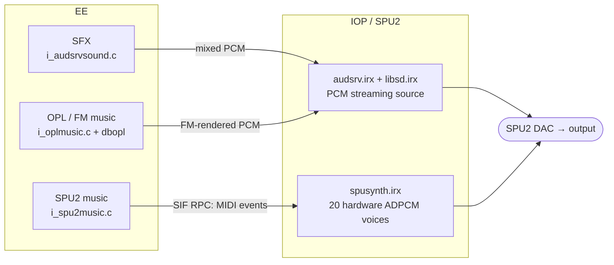
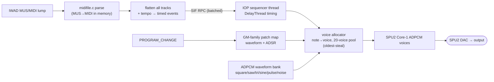

# doomgeneric — PlayStation 2 port (technical)

A PS2 port of [doomgeneric](https://github.com/ozkl/doomgeneric) built on the
[ps2dev](https://github.com/ps2dev/ps2dev) SDL2 toolchain. This document covers
the PS2-specific design; for an overview and build presets see the
[top-level README](../README.md).

## Design: upstream stays pristine

The upstream sources in `../doomgeneric` are kept **unmodified** so syncing with
ozkl stays trivial. All PS2 code lives here in `ps2/`. A couple of upstream files
are *replaced* (compiled from here instead of upstream), and there are only a few
small `#ifdef __PS2__` hooks in upstream core files (IWAD selection, music-module
selection, an audio-backend printf).

## Audio architecture



- **SFX** are always mixed on the EE and streamed to the SPU2's one PCM source
  via audsrv.
- **Music** has two interchangeable `music_module_t` backends, chosen at build
  time in `i_sound.c`:
  - **OPL/FM** (`i_oplmusic.c` + `opl*.c` + `dbopl.c`) — default. Renders AdLib
    FM from the IWAD's GENMIDI lump into the audsrv stream.
  - **SPU2 hardware-voice synth** (`i_spu2music.c` + `iop/spusynth/`) — built
    with `SPU_MUSIC=1`. Drives the chip's own ADPCM voices (see below).

### SPU2 hardware-voice synth

The EE side (`i_spu2music.c`) loads `spusynth.irx`, parses the song with
`midifile.c` (MUS → MIDI via `mus2mid`, all in memory), flattens every track in
absolute-tick order with tempo applied into `(delay_us, cmd, chan, note, vel)`
events (`spusynth_rpc.h`), and ships them to the IOP in batches over **SIF RPC**.

The IOP side (`iop/spusynth/spusynth.c`) runs a sequencer thread that plays the
event stream with `DelayThread` timing onto a pool of 20 Core-1 voices
(note→voice map, oldest-steal when full). It synthesises a small ADPCM
**waveform bank** (square / saw / triangle / sine / pulse + white-noise) into SPU
RAM at boot, and a GM-family **patch map** maps each channel's current program to
a waveform + ADSR; channel 9 plays the noise sample as percussion at a fixed
per-drum pitch.



Hard-won SPU2 facts (see the long-form notes in the source):
- Key voices on **Core 1** — audsrv makes it the live DAC core and zeroes
  Core 0's master volume.
- Open the **`MMIX` voice-dry gates** (`SndL|SndR = 0xC00`) on Core 1; bits 0–7
  are input gates only.
- `sceSdVoiceTrans` uses the **pointer value** of its `spuaddr` arg as the SPU
  byte address (no dereference), and the IO path casts it to `u16` — so pass
  `(u32*)0x5000`, not `&var`, and keep it < 64 KB.
- SPU2 volume registers are 15-bit signed: **`0x3FFF` is max** (`0x7FFF` reads
  negative → silence).
- We piggyback on audsrv (which powers the chip up); a standalone libsd/libspu2
  driver stays silent under this setup.

## Boot

`main()` (in `doomgeneric_ps2.c`) brings up the libdebug GS text console
(`ps2_bootscr.c`) for the boot log, holds it ~3 s, then SDL takes the GS for the
game framebuffer.

**The ~28 s boot stall** was *not* libdebug, cdfs, or audio — it was
libps2_drivers' `waitUntilDeviceIsReady` (called by SDL2main's `main` before
ours): with an embedded/host: WAD the device it polls never reports ready, so it
spun out a long timeout (PCSX2 flagged the EE loop at `0x205FC0`, inside that
function). `ps2_drivers_stub.c` overrides it (and stubs the unused USB/dev9
drivers). Boot now reaches audio in ~3.8 s instead of ~33 s.

## Files here

| File | Purpose |
|---|---|
| `doomgeneric_ps2.c` | SDL2 video backend + `main()`; lazy SDL init so the boot log shows first |
| `ps2_bootscr.c` | GS text console for the boot log (redirects stdout via `_write`) |
| `ps2_drivers_stub.c` | **boot fix**: override `waitUntilDeviceIsReady`; stub unused USB/dev9 |
| `ps2_audio.c` | enables loading IRX from EE buffers before SDL audio opens |
| `ps2_audio_driver.c` | our `init_audio_driver`: loads libsd.irx + audsrv.irx, `audsrv_init()` |
| `i_audsrvsound.c` | SFX backend (EE mix → audsrv) |
| `i_oplmusic.c`, `opl*.c`, `dbopl.c` | OPL/FM music backend (default) |
| `i_spu2music.c` | **SPU2 synth music backend** (EE): MIDI → flatten → RPC → play |
| `iop/spusynth/spusynth.c` | **SPU2 synth IOP module**: RPC server + sequencer + voice pool + waveform bank |
| `iop/spusynth/spusynth_rpc.h` | shared EE↔IOP wire protocol (event format, RPC ids) |
| `ps2_spusynth.c` | EE loader for the S1/S2 `SPU_BEEP` self-test |
| `midifile.c`, `mus2mid` (upstream) | MIDI parsing / MUS→MIDI conversion (shared by both music engines) |
| `ps2_iwad.c` | `PS2_GetIWAD()`: pick IWAD from cdfs / hostfs / embedded |
| `ps2_menu.c` | libpad controller menu drawn on the GS text screen |
| `ps2_pad.c` | in-game controller input (libpad → Doom keys) |
| `ps2_cdfs.c`, `w_file_cdfs.c` | read a WAD on demand off a cdfs disc/ISO |
| `w_file_ps2.c`, `w_file_mem.c` | hostfs / embedded-WAD file backends |
| `doom1_wad.c` | embedded shareware IWAD (`bin2c` from `DOOM1.WAD`) |
| `audsrv_irx.c`, `libsd_irx.c`, `spusynth_irx.c` | embedded IRX modules (`bin2c`) |
| `SYSTEM.CNF` | ISO boot descriptor (`BOOT2 = cdrom0:\DOOMGEN.ELF`) |

## Building

Needs the `ps2dev` toolchain (`$PS2SDK`, `$GSKIT`). Easiest via the repo's
`build.sh` (see the [top-level README](../README.md)); raw `make` also works:

```sh
docker run --rm -u $(id -u):$(id -g) -v <repo>:/work -w /work/ps2 ps2dock:local \
  make [EMBED_WAD=1] [SPU_MUSIC=1] [GSKIT_VIDEO=1 GS480P=1]
```

- `EMBED_WAD=1` bakes in `DOOM1.WAD` (must be present in `ps2/`).
- `SPU_MUSIC=1` selects the SPU2 hardware-voice synth instead of OPL music and
  compiles `i_spu2music.o` + the `spusynth.irx` (built via `iop/spusynth/`).
- `audsrv.irx` / `libsd.irx` are copied from the SDK automatically.

## Running (PCSX2 or hardware)

Load `doomgeneric.elf` (or boot the ISO). The boot log shows for ~3 s, then the
game/demo loop starts.

- **WADs**: the WAD is found on cdfs (disc/ISO, as `DOOM.WAD`), on hostfs
  (`host:` next to the ELF), or the embedded shareware copy. Several found →
  controller menu.
- **Sound**: SFX via audsrv. Music via OPL/FM (default) or the SPU2 synth
  (`SPU_MUSIC=1`) — both play the IWAD's MUS/MIDI music.

## Copyright / WADs

Doom WADs are **not** part of this repository (`*.wad` is git-ignored). The
shareware `DOOM1.WAD` is freely redistributable; `DOOM.WAD`, `DOOM2.WAD`, etc.
are commercial — do not commit, embed for distribution, or share them. The
default build embeds nothing, so the distributable ELF contains no game data.
